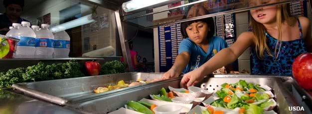

```{r setup, include=FALSE}
knitr::opts_chunk$set(echo = TRUE, warning = FALSE, message = FALSE)
```

```{r}
library(here)
library(lubridate)
library(tidyverse)
library(zoo)
library(feasts)
library(tsibble)
library(patchwork)

options(scipen = 999)
```

# My Question:

My analysis seeks to explore the questions: Is there seasonality in how U.S. school food programs feed students? What about long-term trends, and how did any trends change in 2020 during school closures from the Covid-19 pandemic? 

## Background

The National School Lunch Program (NSLP) is an enormous food system with major implications for equity in American K-12 education systems. Every day, NSLP provides ~30 million children school lunch at free or reduced prices (1). It operates in public and nonprofit private schools and residential childcare facilities (2). 

To provide meals at free and reduced cost to students, participating school districts are reimbursed cash subsidies for every qualifying meal they serve. To qualify for subsidy, meals served by Nutrition Services operators must meet federal meal pattern policies which define meal content around qualifying food group combinations, sugar content, etc. 



**** something about impact of access to nutrition on student behavior and performace, with sources cited! 

# Data Description

The Food and Nutrition Services sector of the USDA offers [monthly and annual reports](https://www.fns.usda.gov/data-research) of national participation in the National School Lunch Program and other school meal programs subsidized by the USDA (breakfast, seamless summer, supper, and snacks). 

To answer my questions...

**My analysis seeks to explore the questions: Is there seasonality in how U.S. school food programs feed students? What about long-term trends, and how did any trends change in 2020 during school closures from the Covid-19 pandemic? **

... I used the National Level Monthly Data for the National School Lunch Program, which comes in PDF and Excel formats which are public. I downloaded the Excel format of the monthly data and did some tidying in Excel to make sure the .csv version would be friendly with R! There were some formatting thing like merged cells that included titles, not observations, as rows, which I eliminated before downloading as a .csv in my R project. 

```{r}
#read in the monthly lunch data 
usda_monthly <- read.csv(here("data", "usda_monthly_data_tidy.csv"))
```

Even after a little manipulation in excel, there were changes to be made for easier manipulation of my monthly lunch data dataframe. Here, I change the first column name from `fiscal_year` to `month`, which better represents the column information. Reading in the data mysteriously added 2 columns that were not in the downloaded csv; I remove them here. Finally, there is a second row representing the fiscal year, but this one is _actually_ the fiscal year. I change the name from `fiscal_year.1` to `fiscal_year`. Now the data is almost ready for some stats! 

```{r}
#change first column name 
colnames(usda_monthly)[1] <- "month"

#delete the weird columns that got added between downloading the raw data to my 
#local computer and reading it to .Rmd
usda_monthly <- select(usda_monthly, -c("X", "X.1"))

#change last column name
colnames(usda_monthly)[9] <- "fiscal_year"
```

Before we get there, though, 

```{r}
#remove percent signs from percent_free_of_total_lunches and 
#percent_reduced_price_of_total_lunches columns
usda_monthly <- usda_monthly %>% 
 mutate(percent_free_of_total_lunches = gsub('%','', percent_free_of_total_lunches)) %>% 
  mutate(percent_reduced_price_of_total_lunches = gsub('%','', percent_reduced_price_of_total_lunches)) %>%
  mutate(month = gsub("-", " ", month))

#convert month column to class datetime from class character
usda_monthly <- usda_monthly %>% 
  mutate("month" = zoo::as.yearmon(month, "%y %b"))
```

```{r}
#check class of all columns
lapply(usda_monthly, class)

#apply numeric to character columns
usda_monthly <- usda_monthly %>% 
  mutate_if(is.character, as.numeric)

#check to see if class conversion worked 
lapply(usda_monthly, class)
```


```{r}
#plots 
total_lunches_initial <- ggplot(data = usda_monthly, aes(x = month, y = total_lunches_served)) +
  geom_line() +
  theme_minimal()
```

```{r}
percent_free_inital <- ggplot(data = usda_monthly, aes(x = month, y = percent_free_of_total_lunches)) +
  geom_line() +
  theme_minimal()

total_lunches_initial / percent_free_inital
```

# Analysis Plan

## Total Participation in NSLP

```{r}
#confusingly, converting the data I want in my time series requires data of class `yearmonth` not `yearnon` I learned I can use `yearmonth()` from the tsibble package to make a happy tsibble
usda_monthly <- usda_monthly %>% 
  mutate(month_tsib = yearmonth(month))

monthly_tsib <- usda_monthly %>%
  select(c(month_tsib, total_lunches_served)) %>% 
  as_tsibble()
```

```{r}
total_decomp = monthly_tsib %>% 
  model(
    classical_decomposition(total_lunches_served, type = "additive")
  ) %>% 
  components()
head(total_decomp)

total_auto <- autoplot(total_decomp)
```

```{r}
total_acf <- acf(monthly_tsib, lag.max = 12)

total_auto 
total_acf
```


## Participation of Free-Lunch Eligible Students 

```{r}
free_tsib <- usda_monthly %>% 
  select(c(month_tsib, percent_free_of_total_lunches)) %>% 
  as_tsibble()
```

```{r}
free_decomp = free_tsib %>% 
  model(
    classical_decomposition(percent_free_of_total_lunches, type = "additive")
  ) %>% 
  components()
head(free_decomp)

autoplot(free_decomp)
```

```{r}
acf(free_tsib, lag.max = 12)
```

# Summarize results visually and in words

# Next steps and future directions

# References

(1) https://www.ers.usda.gov/topics/food-nutrition-assistance/child-nutrition-programs/national-school-lunch-program/ 
(2) https://fns-prod.azureedge.net/sites/default/files/resource-files/NSLPFactSheet.pdf