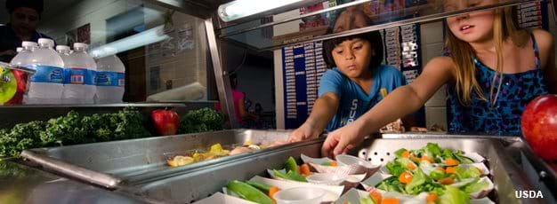

```{r setup, include=FALSE}
knitr::opts_chunk$set(echo = TRUE, warning = FALSE, message = FALSE)
```

```{r}
library(here)
library(lubridate)
library(tidyverse)
library(zoo)
library(feasts)
library(tsibble)
library(patchwork)

options(scipen = 999)
```

# My Question:

My analysis seeks to explore the questions: Is there seasonality in how U.S. school food programs feed students? What about long-term trends, and how did any trends change in 2020 during school closures from the Covid-19 pandemic? 

I have previous experience working in school food systems to expand access to this resource for school communities, but you need no time in cafeterias to guess that there would be seasonality in feeding kids. Students off for summer means fewer students participating in the NSLP in July and August. I was more interested in understanding seasonal differences within the school year: for example, _does the US feed more students in fall compared to winter?_

## Background

The National School Lunch Program (NSLP) is an enormous food system with major implications for equity in American K-12 education systems. Every day, NSLP provides ~30 million children school lunch at free or reduced prices (1). It operates in public and nonprofit private schools and residential childcare facilities (2). 

To provide meals at free and reduced cost to students, participating school districts are reimbursed cash subsidies for every qualifying meal they serve. To qualify for subsidy, meals served by Nutrition Services operators must meet federal meal pattern policies which define meal content around qualifying food group combinations, sugar content, etc. 



**** something about impact of access to nutrition on student behavior and performace, with sources cited! 

# Data Description

The Food and Nutrition Services sector of the USDA offers [monthly and annual reports](https://www.fns.usda.gov/data-research) of national participation in the National School Lunch Program and other school meal programs subsidized by the USDA (breakfast, seamless summer, supper, and snacks). 

To answer my questions...

**My analysis seeks to explore the questions: Is there seasonality in how U.S. school food programs feed students? What about long-term trends, and how did any trends change in 2020 during school closures from the Covid-19 pandemic? **

... I used the [National Level Monthly Data for the National School Lunch Program](https://www.fns.usda.gov/pd/child-nutrition-tables), which comes in publicly available .pdf and .xlsx formats. I downloaded the .xlsx format of the monthly data and did some tidying in Excel to make sure the .csv version would be friendly with R; there were some formatting issues, like merged cells that included titles, not observations, as rows, which I eliminated before downloading as a .csv in my R project.

```{r}
#read in the monthly lunch data 
usda_monthly <- read.csv(here("data", "usda_monthly_data_tidy.csv"))
```

Even after this manipulation in excel, there were changes to be made for easier manipulation of my monthly lunch data dataframe. Here, I give columns more descriptive names, remove odd columns that were added to the dataframe when I read in the .csv, mutate columns to exclude "%" "-" or spaces that R cannot make sense of. 

```{r}
#change first column name 
colnames(usda_monthly)[1] <- "month"

#delete the weird columns that got added between downloading the raw data to my 
#local computer and reading it to .Rmd
usda_monthly <- select(usda_monthly, -c("X", "X.1"))

#change last column name
colnames(usda_monthly)[9] <- "fiscal_year"
```

```{r}
#remove percent signs from percent_free_of_total_lunches and 
#percent_reduced_price_of_total_lunches columns
usda_monthly <- usda_monthly %>% 
 mutate(percent_free_of_total_lunches = gsub('%','', percent_free_of_total_lunches)) %>% 
  mutate(percent_reduced_price_of_total_lunches = gsub('%','',percent_reduced_price_of_total_lunches)) %>%
  mutate(month = gsub("-", " ", month))
```

Last, I make sure the class of each column is correct. All of the columns were of class `numeric` when read in, so I mutated the `month` column to `yearmon` using the `zoo` package, and everything else to numeric. 

```{r, results='hide'}
#convert month column to class datetime from class character
usda_monthly <- usda_monthly %>% 
  mutate("month" = zoo::as.yearmon(month, "%y %b"))

#check class of all columns
lapply(usda_monthly, class)

#the data in most of the columns is of class character, but needs to be numeric
usda_monthly <- usda_monthly %>% 
  mutate_if(is.character, as.numeric)
```

Finally, to have an initial look at my data, I make simple line graphs here: 

```{r}
#total lunches served plot 
total_lunches_testplot <- ggplot(data = usda_monthly, aes(x = month, y = total_lunches_served)) +
  geom_line(color = "darkcyan") +
  theme_minimal() +
  labs(title = "NSLP Lunches Served (Monthly)",
       x = "Month",
       y = "Total Lunches Served")

usda_monthly <- usda_monthly %>% 
  mutate(total_free_lunches = (total_lunches_served * percent_free_of_total_lunches) / 100)

monthly_free_testplot <- ggplot(data = usda_monthly, aes(x = month, y = total_free_lunches)) +
  geom_line(color = "darkcyan") +
  theme_minimal() +
  labs(title = "NSLP Free Lunches Served (Monthly)",
       x = "Month",
       y = "Total Lunches Served")

total_lunches_testplot / monthly_free_testplot

```

At a first glance, I can see that there are seasonal dips in NSLP lunch participation in the summers, as expected. There also appears to be a dip in participation before January, which I would suspect is due to holiday recesses. It seems that the start of the school year does have higher participation than any of the winter and spring months, though. 

I can see that participation dropped dramatically when schools closed, by about 2/3 for all students, and by 1/2 for just the students who qualify for free lunch. 

# Analysis Plan

My analysis is split into two sections: one for all lunches served for the 2017-2020 SYs and one for all of the lunches served which qualified for whole reimbursement from the USDA NSLP, or free lunches. I thought it might be interesting to see if seasonality and long term trends compare between the whole group and the subgroup. 

For both, I create a tsibble with the months as class `yearmonth` and the total lunches served per month, then create an additive classical decomposition model. 

I then use this model to create an autoplot which helps to visualize the presence of seasonality and long-term trends in the data for both groups. 

Finally, I generate an autocorrelation function with a lag of 12 because I want to see how much participation in one month is correlated with participation for the rest of the school year. 

## Total Participation in NSLP

```{r return = FALSE}
#confusingly, converting the data I want in my time series requires data of class `yearmonth` not `yearmon` I learned I can use `yearmonth()` from the tsibble package to make a tsibble with the correct time class 
usda_monthly <- usda_monthly %>% 
  mutate(month = yearmonth(month))

monthly_tsib <- usda_monthly %>%
  select(c(month, total_lunches_served)) %>% 
  as_tsibble()
```

```{r}
total_decomp = monthly_tsib %>% 
  model(
    classical_decomposition(total_lunches_served, type = "additive")
  ) %>% 
  components()

total_auto <- autoplot(total_decomp) %>% 
  labs(title = "Classical Decomposition for USDA NSLP Lunch Participation")
```

```{r}
total_acf <- acf(monthly_tsib, lag.max = 12)
```

```{r}
total_acf
total_auto
```


## Participation of Free-Lunch Eligible Students 

```{r}
free_tsib <- usda_monthly %>% 
  select(c(month, total_free_lunches)) %>% 
  as_tsibble()
```

```{r}
free_decomp = free_tsib %>% 
  model(
    classical_decomposition(total_free_lunches, type = "additive")
  ) %>% 
  components()

free_auto <- autoplot(free_decomp)
free_acf <- acf(free_tsib, lag.max = 12)

```

```{r}
free_auto
free_acf
```

# Summarize results visually and in words

```{r}

```


# Next steps and future directions

# References

(1) https://www.ers.usda.gov/topics/food-nutrition-assistance/child-nutrition-programs/national-school-lunch-program/ 
(2) https://fns-prod.azureedge.net/sites/default/files/resource-files/NSLPFactSheet.pdf